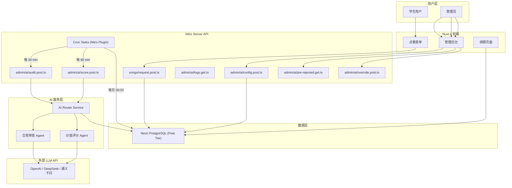
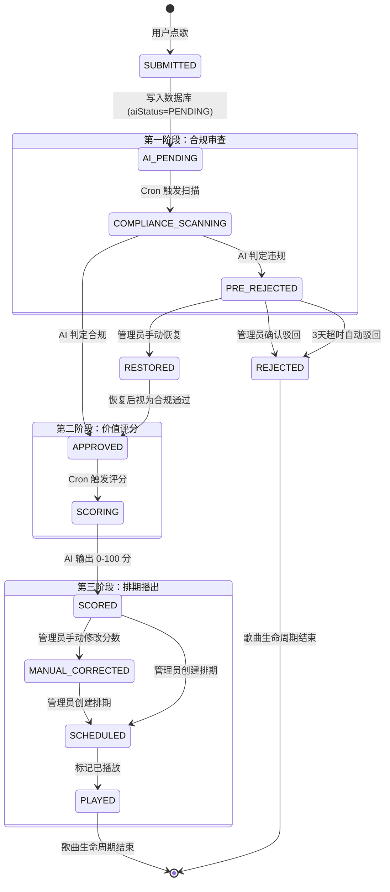
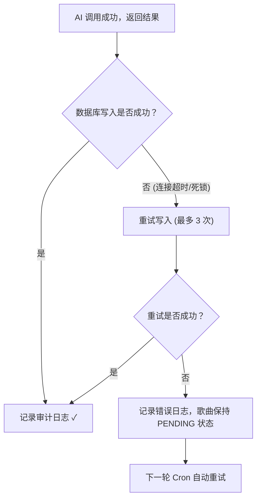

# VoiceHub AI 自动化审核与价值评分系统 — 技术实施方案

> **项目**: `music.newfires.top` (VoiceHub v1.5.7)
> **架构**: Nuxt 4 + Neon PostgreSQL (Free) + Drizzle ORM，部署于 **Vercel Free Tier**
> **日期**: 2026-04-19

---

## 目录

1. [架构总览](#1-架构总览)
2. [数据库 Schema 增量设计](#2-数据库-schema-增量设计)
3. [歌曲生命周期状态机](#3-歌曲生命周期状态机)
4. [API 端点设计](#4-api-端点设计)
5. [提示词工程模板](#5-提示词工程模板)
6. [Vercel Free + Neon Free 部署约束](#6-vercel-free--neon-free-部署约束)
7. [定时任务调度策略](#7-定时任务调度策略)
8. [潜在死角与解决方案](#8-潜在死角与解决方案)
9. [前端管理面板集成要点](#9-前端管理面板集成要点)
10. [实施路线图](#10-实施路线图)

---

## 1. 架构总览



### 核心设计原则

| 原则 | 说明 |
|------|------|
| **最小侵入** | 在现有 `Song` 表上新增列，不破坏已有 `played`/`reject` 流程 |
| **LLM 无关性** | 通过统一的 AI Router 抽象 LLM 调用，支持 OpenAI、DeepSeek、通义千问等多种后端 |
| **渐进回退** | AI 系统故障时，歌曲仍保持 `PENDING` 状态，管理员可完全手动运作 |
| **成本可控** | 每次调用记录 Token 消耗，设置每日/每月 Token 上限 |
| **Free Tier 适配** | 所有设计均适配 Vercel 10s 超时 + Neon 0.5GB 存储 + 无 Redis 的约束 |

---

## 2. 数据库 Schema 增量设计

> [!IMPORTANT]
> 以下所有改动均为**增量式**。现有的 `Song` 表保持 `played` 布尔字段不变，通过新增的 `aiStatus` 枚举来扩展生命周期。

### 2.1 新增枚举类型

```typescript
// app/drizzle/schema.ts 新增

export const aiSongStatusEnum = pgEnum('ai_song_status', [
  'PENDING',        // 等待 AI 审核
  'APPROVED',       // AI 合规通过
  'PRE_REJECTED',   // AI 预驳回（等待人工复核）
  'REJECTED',       // 正式驳回（超时自动或人工确认）
  'RESTORED',       // 管理员从预驳回恢复
  'SCORED',         // 已完成价值评分
]);
```

### 2.2 `Song` 表新增列

```typescript
// 在现有 songs pgTable 中追加以下列:

// AI 审核状态（默认 PENDING，表示等待 AI 处理）
aiStatus: text('ai_status').default('PENDING'),

// AI 合规审查结果
aiComplianceResult: text('ai_compliance_result'),     // JSON: { passed: boolean, reason: string, categories: string[] }
aiComplianceAt: timestamp('ai_compliance_at'),         // 审查时间戳

// AI 价值评分
aiScore: integer('ai_score'),                          // 0-100 分值
aiScoreBreakdown: text('ai_score_breakdown'),          // JSON: { dimensions: [{name, score, reason}], summary }
aiScoreAt: timestamp('ai_score_at'),                   // 评分时间戳

// 人工干预标记
aiManualCorrected: boolean('ai_manual_corrected').default(false),
aiManualScore: integer('ai_manual_score'),              // 管理员手动修改后的分数
aiManualCorrectedBy: integer('ai_manual_corrected_by'), // 操作管理员 ID
aiManualCorrectedAt: timestamp('ai_manual_corrected_at'),

// 预驳回超时自动驳回的截止时间
aiPreRejectedAt: timestamp('ai_pre_rejected_at'),       // 预驳回时间，3 天后自动转正式
```

### 2.3 新增 `ai_audit_logs` 表

```typescript
export const aiAuditLogs = pgTable('ai_audit_logs', {
  id: serial('id').primaryKey(),
  songId: integer('song_id').notNull(),
  action: varchar('action', { length: 50 }).notNull(),
    // COMPLIANCE_SCAN, COMPLIANCE_PASS, COMPLIANCE_PRE_REJECT,
    // VALUE_SCORE, MANUAL_OVERRIDE, AUTO_REJECT, MANUAL_RESTORE
  inputTokens: integer('input_tokens').default(0),
  outputTokens: integer('output_tokens').default(0),
  totalTokens: integer('total_tokens').default(0),
  modelName: varchar('model_name', { length: 100 }),
  promptVersion: varchar('prompt_version', { length: 50 }),
  requestPayload: text('request_payload'),   // 请求摘要 (截断存储，不超过 2KB)
  responsePayload: text('response_payload'), // 响应摘要
  latencyMs: integer('latency_ms'),
  error: text('error'),
  createdAt: timestamp('created_at').defaultNow().notNull(),
  operatorId: integer('operator_id'),        // 若为人工操作，记录管理员 ID
});
```

### 2.4 新增 `ai_settings` 表

```typescript
export const aiSettings = pgTable('ai_settings', {
  id: serial('id').primaryKey(),
  // LLM 连接配置
  provider: varchar('provider', { length: 50 }).default('openai'),   // openai | deepseek | qwen | custom
  apiKey: text('api_key'),                    // 加密存储
  apiBaseUrl: text('api_base_url'),           // 自定义 endpoint
  modelName: varchar('model_name', { length: 100 }).default('gpt-4o-mini'),
  connectionVerified: boolean('connection_verified').default(false),
  connectionVerifiedAt: timestamp('connection_verified_at'),

  // 审核准则
  complianceCriteria: text('compliance_criteria'),   // 管理员自定义的合规审查准则
  scoringCriteria: text('scoring_criteria'),         // 管理员自定义的评分准则

  // 功能开关
  enableAiCompliance: boolean('enable_ai_compliance').default(false),
  enableAiScoring: boolean('enable_ai_scoring').default(false),

  // 成本控制
  dailyTokenLimit: integer('daily_token_limit').default(100000),
  monthlyTokenLimit: integer('monthly_token_limit').default(2000000),

  // 预驳回自动转正天数
  preRejectGraceDays: integer('pre_reject_grace_days').default(3),

  // 排序权重配置
  scoreSortWeight: integer('score_sort_weight').default(70),   // AI 分数权重 (0-100)
  voteSortWeight: integer('vote_sort_weight').default(30),      // 热度权重 (0-100)

  // 批量扫描配置
  batchSize: integer('batch_size').default(10),                 // 每批处理歌曲数
  scanIntervalMinutes: integer('scan_interval_minutes').default(30),

  createdAt: timestamp('created_at').defaultNow().notNull(),
  updatedAt: timestamp('updated_at').defaultNow().notNull(),
});
```

### 2.5 Drizzle Migration 命令

```bash
# 生成迁移文件
pnpm db:generate

# 执行迁移
pnpm db:migrate

# 或直接推送（开发环境）
pnpm db:push
```

---

## 3. 歌曲生命周期状态机

### 3.1 完整状态流转图



### 3.2 状态流转规则表

| 当前状态 | 触发事件 | 目标状态 | 执行者 | 附加动作 |
|----------|----------|----------|--------|----------|
| `PENDING` | Cron 合规扫描 | `APPROVED` | AI | 记录 `aiComplianceResult`、Token 消耗 |
| `PENDING` | Cron 合规扫描 | `PRE_REJECTED` | AI | 记录驳回理由、设置 `aiPreRejectedAt` |
| `PRE_REJECTED` | 管理员恢复 | `RESTORED` → `APPROVED` | 管理员 | 记录审计日志 |
| `PRE_REJECTED` | 管理员确认驳回 | `REJECTED` | 管理员 | 执行现有 reject 流程（删除投票、排期等） |
| `PRE_REJECTED` | 3天超时 | `REJECTED` | Cron | 同上 |
| `APPROVED` / `RESTORED` | Cron 价值评分 | `SCORED` | AI | 记录 `aiScore`、`aiScoreBreakdown` |
| `SCORED` | 管理员修改分数 | `SCORED` (+ `manual_corrected`) | 管理员 | 设置 `aiManualCorrected=true` |
| `SCORED` | 管理员创建排期 | 进入排期流程 | 管理员 | 使用现有 `schedule.post.ts` |

### 3.3 与现有 `played` 字段的兼容

> [!NOTE]
> 现有系统使用 `songs.played` (boolean) 来标记是否已播放，`reject.post.ts` 直接**删除**被驳回歌曲。新的 AI 系统引入 `aiStatus` 字段作为**并行轨道**，不影响已有逻辑。

兼容策略：

1. **歌曲列表查询**：在 `songs/index.get.ts` 和 `songs/public.get.ts` 中添加 `WHERE aiStatus NOT IN ('PRE_REJECTED', 'REJECTED')` 过滤条件，确保被 AI 预驳回/驳回的歌曲不出现在公开列表中。
2. **排期页面排序**：当 `enableAiScoring = true` 时，排序公式变为：
   ```sql
   ORDER BY
     COALESCE(ai_manual_score, ai_score, 0) * (score_sort_weight / 100.0)
     + vote_count * (vote_sort_weight / 100.0)
   DESC
   ```
3. **管理员驳回**：现有的 `reject.post.ts`（物理删除歌曲）在 AI 系统中仍然可用，作为最终的人工驳回手段。

---

## 4. API 端点设计

### 4.1 管理员 AI 配置

```
POST /api/admin/ai/config
```

```typescript
// server/api/admin/ai/config.post.ts
import { z } from 'zod'

const configSchema = z.object({
  provider: z.enum(['openai', 'deepseek', 'qwen', 'custom']).optional(),
  apiKey: z.string().min(1).optional(),
  apiBaseUrl: z.string().url().optional(),
  modelName: z.string().optional(),
  complianceCriteria: z.string().max(5000).optional(),
  scoringCriteria: z.string().max(5000).optional(),
  enableAiCompliance: z.boolean().optional(),
  enableAiScoring: z.boolean().optional(),
  dailyTokenLimit: z.number().int().min(1000).optional(),
  monthlyTokenLimit: z.number().int().min(10000).optional(),
  preRejectGraceDays: z.number().int().min(1).max(30).optional(),
  scoreSortWeight: z.number().int().min(0).max(100).optional(),
  voteSortWeight: z.number().int().min(0).max(100).optional(),
  batchSize: z.number().int().min(1).max(50).optional(),
  scanIntervalMinutes: z.number().int().min(5).max(1440).optional(),
})
```

### 4.2 连通性校验

```
POST /api/admin/ai/test-connection
```

逻辑：
1. 使用管理员提供的 `apiKey` + `apiBaseUrl` + `modelName`
2. 发送一个极简 prompt（如 `"Reply with OK"`），控制 `max_tokens=5`
3. 返回连通状态、延迟、模型名称

### 4.3 手动触发合规扫描

```
POST /api/admin/ai/audit
```

请求体：
```json
{
  "songIds": [1, 2, 3],    // 可选，指定歌曲 ID；为空则扫描所有 PENDING
  "force": false            // 是否重新扫描已通过合规的歌曲
}
```

### 4.4 手动触发价值评分

```
POST /api/admin/ai/score
```

请求体：
```json
{
  "songIds": [1, 2, 3],    // 可选
  "force": false
}
```

### 4.5 预驳回列表查询

```
GET /api/admin/ai/pre-rejected?page=1&pageSize=20
```

返回：
```json
{
  "items": [
    {
      "id": 42,
      "title": "xxx",
      "artist": "xxx",
      "aiStatus": "PRE_REJECTED",
      "aiComplianceResult": {
        "passed": false,
        "reason": "该歌曲涉及劣迹艺人...",
        "categories": ["劣迹艺人"]
      },
      "aiPreRejectedAt": "2026-04-19T10:00:00Z",
      "autoRejectAt": "2026-04-22T10:00:00Z",  // 计算字段
      "requester": { "id": 5, "name": "张三", "grade": "高一", "class": "3班" }
    }
  ],
  "total": 5,
  "page": 1
}
```

### 4.6 管理员干预

```
POST /api/admin/ai/override
```

```json
{
  "songId": 42,
  "action": "restore" | "confirm_reject" | "update_score",
  "newScore": 85,           // 仅 action=update_score 时
  "reason": "管理员判定该歌曲合规"
}
```

### 4.7 Token 消耗统计

```
GET /api/admin/ai/logs?page=1&pageSize=50&startDate=2026-04-01&endDate=2026-04-19
```

返回聚合数据：
```json
{
  "logs": [...],
  "summary": {
    "totalCalls": 156,
    "totalInputTokens": 45000,
    "totalOutputTokens": 12000,
    "totalTokens": 57000,
    "estimatedCostUSD": 0.28,   // 按模型定价估算
    "todayTokens": 3200,
    "monthTokens": 57000,
    "dailyLimit": 100000,
    "monthlyLimit": 2000000
  }
}
```

---

## 5. 提示词工程模板

### 5.1 合规审查 System Prompt

```text
# 角色定义
你是一个专业的校园广播站歌曲合规审核系统。你的唯一任务是判断一首歌曲是否适合在中国大陆高中校园广播中播放。

# 审核维度（按严重程度排序）
1. **法律合规**（一票否决）：
   - 涉及国家法律法规明确禁止传播的内容
   - 涉及政治敏感话题
   - 涉及以下劣迹/违法艺人的作品（如有）

2. **内容健康**（一票否决）：
   - 歌词包含明显低俗、暴力、毒品、自杀自残等不适合未成年人的内容
   - 歌曲内容宣扬消极、违法或反社会价值观

3. **校园适宜性**（参考评估）：
   - 歌曲风格是否过于吵闹或不适合广播环境（如纯 DJ/电音）
   - 是否有不适合校园场景的恋爱/成人主题

# 管理员自定义审核准则
{{ADMIN_COMPLIANCE_CRITERIA}}

# 输入格式
你将收到如下 JSON 格式的歌曲信息：
```json
{
  "title": "歌曲名称",
  "artist": "歌手/艺人",
  "musicPlatform": "netease | bilibili | other",
  "recommendation": "用户的推荐语（可能为空）"
}
```

# 输出格式（严格 JSON）
请严格按照以下 JSON Schema 输出，不要添加任何多余的文字：
```json
{
  "passed": true/false,
  "confidence": 0.0-1.0,
  "reason": "中文的简明判断理由（不超过 200 字）",
  "categories": ["命中的违规类别，如为空数组则表示合规"],
  "risk_level": "none | low | medium | high | critical"
}
```

# 重要规则
- 当你**不确定**某首歌是否违规时，倾向于**放行**（passed=true），并将 confidence 设为较低值，交由人工复核。
- 仅根据歌曲名称和歌手信息进行判断，不要臆测歌词内容。如果歌名和歌手都看起来正常，直接放行。
- 绝对不要在 JSON 输出之前或之后附加任何解释性文字。
```

### 5.2 价值评分 System Prompt

```text
# 角色定义
你是一个校园广播站歌曲价值评估系统。你的任务是从多个维度对歌曲进行评分，帮助管理员对歌曲播放顺序做出合理排序。

# 评分维度（总分 100 分）

## 基础维度（共 60 分）
1. **校园适配度** (0-20分)
   - 歌曲风格是否适合校园广播？
   - 是否能营造积极向上的校园氛围？
   - 上课间操/午间/放学等不同时段的适配性

2. **歌曲知名度与传唱度** (0-20分)
   - 该歌曲是否广为人知？
   - 是否容易引起学生共鸣？
   - 是否为经典/热门曲目？

3. **内容积极性** (0-20分)
   - 歌曲传达的情感和价值观是否积极？
   - 是否适合未成年人群体？
   - 是否具有正面的教育/启发意义？

## 加权维度（共 40 分）
4. **语种权重** (0-15分)
   - 中文歌曲：12-15分
   - 英文歌曲：8-12分
   - 日韩/小语种歌曲：5-10分
   - 纯音乐：10-13分

5. **时效性与话题性** (0-15分)
   - 是否为当下热门/流行曲目？
   - 是否与校园活动、节日、季节契合？
   - 是否具有话题讨论价值？

6. **多样性贡献** (0-10分)
   - 该歌曲是否为播放列表带来风格多样性？
   - 是否避免了与其他已排期歌曲的高度重复？

# 管理员自定义评分准则
{{ADMIN_SCORING_CRITERIA}}

# 输入格式
```json
{
  "title": "歌曲名称",
  "artist": "歌手/艺人",
  "musicPlatform": "平台来源",
  "recommendation": "用户推荐语",
  "voteCount": 12,
  "requestedAt": "2026-04-19T10:00:00Z"
}
```

# 输出格式（严格 JSON）
```json
{
  "totalScore": 75,
  "dimensions": [
    { "name": "校园适配度", "score": 16, "maxScore": 20, "reason": "理由" },
    { "name": "歌曲知名度", "score": 18, "maxScore": 20, "reason": "理由" },
    { "name": "内容积极性", "score": 15, "maxScore": 20, "reason": "理由" },
    { "name": "语种权重", "score": 13, "maxScore": 15, "reason": "理由" },
    { "name": "时效性", "score": 8, "maxScore": 15, "reason": "理由" },
    { "name": "多样性贡献", "score": 5, "maxScore": 10, "reason": "理由" }
  ],
  "summary": "综合评价（不超过 100 字）",
  "highlightTags": ["适合午间播放", "经典华语", "高传唱度"]
}
```

# 重要规则
- 评分必须均匀分布，避免所有歌曲都集中在 70-80 分区间。
- 根据歌曲名称和歌手的公开信息进行客观评估。
- 如果你对某首歌曲完全不了解，给出 50 分的中性评分，并在 summary 中说明。
- 绝对不要在 JSON 输出之前或之后附加任何解释性文字。
```

### 5.3 Prompt 注入防护

> [!CAUTION]
> 用户提交的歌曲名称和推荐语可能包含 Prompt 注入攻击文本。必须做好隔离。

```typescript
// server/services/aiService.ts
function sanitizeUserInput(input: string): string {
  // 1. 截断长度（歌名不超过 100 字符，推荐语不超过 500 字符）
  const truncated = input.slice(0, 500)
  // 2. 移除常见注入模式
  const cleaned = truncated
    .replace(/```/g, '')
    .replace(/system\s*:/gi, '')
    .replace(/ignore\s*(previous|above|all)\s*(instructions?|prompts?)/gi, '[FILTERED]')
    .replace(/<\/?[^>]+(>|$)/g, '') // 移除 HTML 标签
  // 3. 使用 JSON 安全嵌入
  return JSON.stringify(cleaned).slice(1, -1) // 去掉包裹的引号，保留转义
}
```

---

## 6. Vercel Free + Neon Free 部署约束

> [!CAUTION]
> VoiceHub 部署在 Vercel Free Tier + Neon Free Tier 上，这两项服务的免费版有严格的资源限制，直接影响 AI 系统的架构决策。

### 6.1 约束清单

| 约束项 | Vercel Free | Neon Free | 影响 |
|--------|-------------|-----------|------|
| **函数超时** | **10 秒** | — | 每次 AI 调用 + DB 写入必须在 10s 内完成 |
| **Cron Jobs** | ❌ 不可用 (Pro+ 功能) | — | 必须使用外部 Cron 服务触发 |
| **带宽** | 100 GB/月 | — | AI API 调用走 server→LLM，不占 Vercel 带宽 |
| **函数调用次数** | 100,000 次/月 | — | 每日 ~3,300 次上限，Cron 触发需控制频率 |
| **存储** | — | **0.5 GB** | `ai_audit_logs` 需定期清理，避免撑爆 |
| **计算时间** | — | **190 小时/月** | 查询需高效，避免全表扫描 |
| **连接数** | — | 有限 (连接池) | 使用 Neon pooled connection string |
| **自动休眠** | — | 5 分钟无活动后休眠 | 首次查询有 ~1-3s 冷启动延迟 |
| **Redis** | ❌ 无 | — | 锁机制改用 DB 行锁或请求级防重 |

### 6.2 超时适配策略

由于 Vercel Free 的 **10 秒函数超时**，每次 Cron 触发的 API 调用必须严格控制处理量：

```typescript
// 每次 Cron 调用的处理约束
const VERCEL_FREE_CONSTRAINTS = {
  maxSongsPerInvocation: 2,    // 每次最多处理 2 首歌（留出 DB 写入时间）
  llmTimeoutMs: 6000,           // LLM 调用超时 6 秒
  dbWriteTimeoutMs: 2000,       // DB 写入超时 2 秒
  totalBudgetMs: 9500,          // 总预算 9.5 秒（留 0.5s 安全余量）
}
```

**单次调用时间预算分配**：

```
[0s]──── Neon 冷启动 (0-2s) ────[2s]──── 查询 PENDING 歌曲 ────[2.5s]
  ──── LLM API 调用 (3-5s) ────[7.5s]──── 写入结果 ────[8.5s]──── 返回 ────[9s]
```

> [!TIP]
> 如果 Neon 处于休眠状态（5分钟无活动），冷启动可能消耗 1-3 秒。建议在 Cron 间隔设为 ≤5 分钟以保持 Neon 活跃，或者接受偶尔因超时而失败的 Cron 调用（下次重试即可）。

### 6.3 存储控制

Neon Free 仅 0.5 GB 存储，`ai_audit_logs` 表需要定期清理：

```typescript
// 每周清理一次，保留最近 30 天的日志
async function cleanupAiLogs() {
  const thirtyDaysAgo = new Date()
  thirtyDaysAgo.setDate(thirtyDaysAgo.getDate() - 30)

  await db
    .delete(aiAuditLogs)
    .where(lt(aiAuditLogs.createdAt, thirtyDaysAgo))
}
```

**存储预估**：
| 表 | 单行大小 (avg) | 每月增量 | 30天存储 |
|----|---------------|----------|----------|
| `ai_audit_logs` | ~500 bytes | ~3,000 行 | ~1.5 MB |
| `Song` 新增列 | ~200 bytes/歌 | — | 可忽略 |
| `ai_settings` | ~1 KB (单行) | — | 可忽略 |
| **合计增量** | — | — | **~2 MB/月** ✅ |

### 6.4 无 Redis 的锁替代方案

由于免费部署无 Redis，使用**数据库行级条件更新**代替分布式锁：

```typescript
// 利用 WHERE 条件实现 "乐观锁" —— 仅当状态仍为 PENDING 时才更新
const updated = await db
  .update(songs)
  .set({
    aiStatus: 'APPROVED',
    aiComplianceResult: resultJson,
    aiComplianceAt: new Date(),
  })
  .where(
    and(
      eq(songs.id, songId),
      eq(songs.aiStatus, 'PENDING')   // 乐观锁：并发安全
    )
  )
  .returning({ id: songs.id })

if (updated.length === 0) {
  // 说明已被其他调用处理或管理员已手动干预，跳过
  console.log(`Song ${songId} already processed, skipping`)
}
```

这种方式完全依赖 PostgreSQL 的 MVCC 机制，无需外部锁服务。

---

## 7. 定时任务调度策略

### 7.1 外部 Cron 方案（Vercel Free 唯一选择）

由于 Vercel Free 不支持 Cron Jobs，必须使用外部服务定时触发 HTTP 端点。推荐方案：

| 方案 | 免费额度 | 最小间隔 | 推荐 |
|------|---------|---------|------|
| **cron-job.org** | 无限 Cron，3 个免费 | 1 分钟 | ⭐ 首选 |
| **GitHub Actions** | 2,000 分钟/月 | 5 分钟 (cron 语法) | 备选 |
| **UptimeRobot** | 50 个监控 | 5 分钟 | 仅作保活 |

#### cron-job.org 配置示例

| 任务名 | URL | 间隔 | 方法 |
|--------|-----|------|------|
| AI 合规扫描 | `https://music.newfires.top/api/cron/ai-compliance` | 每 30 分钟 | POST |
| AI 价值评分 | `https://music.newfires.top/api/cron/ai-scoring` | 每 60 分钟 | POST |
| 预驳回超时处理 | `https://music.newfires.top/api/cron/ai-expire` | 每日 00:00 | POST |
| 审计日志清理 | `https://music.newfires.top/api/cron/ai-cleanup` | 每周日 03:00 | POST |

#### GitHub Actions 备选方案

```yaml
# .github/workflows/ai-cron.yml
name: AI Cron Jobs
on:
  schedule:
    - cron: '*/30 * * * *'  # 每 30 分钟
  workflow_dispatch:         # 允许手动触发

jobs:
  ai-compliance:
    runs-on: ubuntu-latest
    steps:
      - name: Trigger compliance scan
        run: |
          curl -s -X POST \
            -H "Authorization: Bearer ${{ secrets.CRON_SECRET }}" \
            https://music.newfires.top/api/cron/ai-compliance

  ai-scoring:
    runs-on: ubuntu-latest
    if: github.event.schedule == '0 * * * *' || github.event_name == 'workflow_dispatch'
    steps:
      - name: Trigger value scoring
        run: |
          curl -s -X POST \
            -H "Authorization: Bearer ${{ secrets.CRON_SECRET }}" \
            https://music.newfires.top/api/cron/ai-scoring
```

### 7.2 Cron API 端点实现（含鉴权）

```typescript
// server/api/cron/ai-compliance.ts
export default defineEventHandler(async (event) => {
  // 1. 鉴权：通过环境变量中的 CRON_SECRET 验证
  const authHeader = getHeader(event, 'authorization')
  const cronSecret = process.env.CRON_SECRET
  if (!cronSecret || authHeader !== `Bearer ${cronSecret}`) {
    throw createError({ statusCode: 401, message: 'Unauthorized' })
  }

  // 2. 检查 AI 功能是否启用
  const settings = await getAiSettings()
  if (!settings?.enableAiCompliance) {
    return { skipped: true, reason: 'AI compliance disabled' }
  }

  // 3. 检查 Token 预算
  const budget = await checkTokenBudget()
  if (!budget.allowed) {
    return { skipped: true, reason: budget.reason }
  }

  // 4. 查询待扫描歌曲（每次最多 2 首，适配 10s 超时）
  const pendingSongs = await db
    .select()
    .from(songs)
    .where(eq(songs.aiStatus, 'PENDING'))
    .orderBy(asc(songs.createdAt))
    .limit(2)

  if (pendingSongs.length === 0) {
    return { processed: 0, message: 'No pending songs' }
  }

  // 5. 逐首处理（串行，控制总耗时）
  const results = []
  for (const song of pendingSongs) {
    try {
      const result = await runComplianceCheck(song, settings)
      results.push({ songId: song.id, status: result.passed ? 'APPROVED' : 'PRE_REJECTED' })
    } catch (e) {
      console.error(`[AI Compliance] Song ${song.id} failed:`, e.message)
      results.push({ songId: song.id, status: 'ERROR', error: e.message })
    }
  }

  return { processed: results.length, results }
})
```

> [!IMPORTANT]
> 环境变量 `CRON_SECRET` 必须在 Vercel Dashboard 中配置，用于防止外部恶意触发 Cron 端点。

### 7.3 调度频率与成本估算（Vercel Free 适配）

| 任务 | 频率 | 单次处理量 | 单次 Token | 日 Token | 日 Vercel 调用次数 |
|------|------|-----------|-----------|---------|-------------------|
| 合规扫描 | 30 min | **2 首** | ~1,000 | 1,000 × 48 = **48,000** | 48 |
| 价值评分 | 60 min | **2 首** | ~1,600 | 1,600 × 24 = **38,400** | 24 |
| 超时驳回 | 24 hr | 无限 | 0 | 0 | 1 |
| 日志清理 | 每周 | — | 0 | 0 | ~0.14 |
| **合计** | — | — | — | **~86,400** | **~73** |

> [!TIP]
> **Vercel Free 月调用预算**：73 × 30 = 2,190 次/月，远低于 100,000 的月上限 ✅
>
> **Token 成本**：
> - `gpt-4o-mini`：~86K tokens/日 × $0.45/1M ≈ **$0.04/天 ≈ ¥0.3/天**
> - `DeepSeek`：≈ **¥0.05/天**（几乎可忽略）
>
> 相比之前每次处理 10 首的方案，Vercel 适配版每次仅处理 2 首，日 Token 消耗降低 ~80%，但处理积压时间会相应拉长（如 20 首待审核歌曲需要 ~5 小时全部处理完毕）。对于校园点歌场景，这完全可接受。

### 7.4 Neon 冷启动应对

Neon Free 在 5 分钟无活动后自动休眠，冷启动需 1-3 秒。在 10s 超时约束下这很关键：

```typescript
// server/utils/neon-warmup.ts
// 在 Cron 端点开头先执行轻量查询唤醒 Neon
async function warmupNeon(): Promise<number> {
  const start = Date.now()
  await db.execute(sql`SELECT 1`)
  const latency = Date.now() - start
  if (latency > 1000) {
    console.log(`[Neon] Cold start detected: ${latency}ms`)
  }
  return latency
}

// 在 Cron 处理函数中使用
export default defineEventHandler(async (event) => {
  // ... 鉴权 ...

  const warmupMs = await warmupNeon()
  const remainingBudget = 9500 - warmupMs

  // 根据剩余时间动态决定处理量
  const maxSongs = remainingBudget > 7000 ? 2 : 1  // 冷启动严重时只处理 1 首

  // ... 处理逻辑 ...
})
```

> [!TIP]
> **保活策略**（可选）：如果使用 cron-job.org，可以额外添加一个每 4 分钟 ping 一次 `/api/health` 的任务，保持 Neon 活跃，避免冷启动。但这也意味着 Neon 的 190 小时/月计算时间会被消耗更快。对于校园场景（主要白天活跃），建议仅在 7:00-22:00 期间保活。

---

---

## 8. 潜在死角与解决方案

### 8.1 并发冲突

| 场景 | 风险 | 解决方案 |
|------|------|----------|
| Cron 正在扫描某歌曲，管理员同时手动驳回 | 状态不一致 | 使用乐观锁：`UPDATE ... WHERE aiStatus = 'PENDING'` + `RETURNING` 判断 |
| 两个 Cron 请求同时触发（cron-job.org 偶发重复） | 重复处理 + Token 浪费 | 数据库行级乐观锁天然防重（同一首歌不会被两个请求同时更新成功） |
| 管理员修改 AI 分数后，Cron 重新评分覆盖 | 人工修改被覆盖 | `aiManualCorrected = true` 的歌曲**跳过** AI 重新评分 |

> [!NOTE]
> 由于 Vercel Free 无 Redis，我们完全依赖 PostgreSQL 的行级乐观锁（MVCC）。在 Vercel Serverless 场景下，两个并发 Cron 请求各自查询到相同的 PENDING 歌曲，但只有先完成的那个能成功 `UPDATE ... WHERE aiStatus = 'PENDING'`，另一个的 `RETURNING` 会返回空行，自然跳过。这比分布式锁更简单可靠。

### 8.2 API 频率限制

| LLM 提供商 | RPM 限制 (免费/低级) | 应对策略 |
|------------|---------------------|----------|
| OpenAI | 500 RPM (Tier 1) | 批间延迟 200ms，单批并发 ≤ 3 |
| DeepSeek | 60 RPM (免费) | 批间延迟 1500ms，单批并发 = 1 |
| 通义千问 | 120 RPM (起步) | 批间延迟 600ms，单批并发 ≤ 2 |

```typescript
// 自适应速率控制
function getDelayForProvider(provider: string): { maxConcurrency: number; delayMs: number } {
  switch (provider) {
    case 'deepseek': return { maxConcurrency: 1, delayMs: 1500 }
    case 'qwen':     return { maxConcurrency: 2, delayMs: 600 }
    case 'openai':   return { maxConcurrency: 3, delayMs: 200 }
    default:         return { maxConcurrency: 1, delayMs: 1000 }
  }
}
```

### 8.3 数据库状态回滚



> [!IMPORTANT]
> **关键不变量**：任何异常情况下，歌曲只会**保持在 `PENDING` 状态**，而不会进入中间不一致状态。具体实现方式是：先调用 AI 获取结果，再在事务中更新数据库。

### 8.4 LLM 幻觉与输出解析

```typescript
function parseAiResponse<T>(raw: string, schema: z.ZodType<T>): T {
  // 1. 尝试直接 JSON 解析
  try {
    const parsed = JSON.parse(raw)
    return schema.parse(parsed)
  } catch {}

  // 2. 提取 ```json ... ``` 代码块
  const jsonMatch = raw.match(/```json\s*([\s\S]*?)```/)
  if (jsonMatch) {
    try {
      const parsed = JSON.parse(jsonMatch[1].trim())
      return schema.parse(parsed)
    } catch {}
  }

  // 3. 尝试找到第一个 { 和最后一个 }
  const firstBrace = raw.indexOf('{')
  const lastBrace = raw.lastIndexOf('}')
  if (firstBrace !== -1 && lastBrace > firstBrace) {
    try {
      const parsed = JSON.parse(raw.slice(firstBrace, lastBrace + 1))
      return schema.parse(parsed)
    } catch {}
  }

  // 4. 所有解析均失败
  throw new Error(`Failed to parse AI response: ${raw.slice(0, 200)}...`)
}
```

### 8.5 Token 配额耗尽

```typescript
async function checkTokenBudget(): Promise<{ allowed: boolean; reason?: string }> {
  const settings = await getAiSettings()
  const today = new Date().toISOString().split('T')[0]

  // 查询今日已消耗 Token
  const dailyUsage = await db
    .select({ total: sql<number>`COALESCE(SUM(total_tokens), 0)` })
    .from(aiAuditLogs)
    .where(gte(aiAuditLogs.createdAt, new Date(today)))

  if (dailyUsage[0].total >= settings.dailyTokenLimit) {
    return { allowed: false, reason: `日 Token 配额已耗尽 (${dailyUsage[0].total}/${settings.dailyTokenLimit})` }
  }

  // 查询本月已消耗 Token
  const monthStart = today.slice(0, 7) + '-01'
  const monthlyUsage = await db
    .select({ total: sql<number>`COALESCE(SUM(total_tokens), 0)` })
    .from(aiAuditLogs)
    .where(gte(aiAuditLogs.createdAt, new Date(monthStart)))

  if (monthlyUsage[0].total >= settings.monthlyTokenLimit) {
    return { allowed: false, reason: `月 Token 配额已耗尽 (${monthlyUsage[0].total}/${settings.monthlyTokenLimit})` }
  }

  return { allowed: true }
}
```

### 8.6 Vercel 10s 超时兜底

```typescript
// 在 Cron 处理函数中预留超时检查点
async function processWithTimeout<T>(
  fn: () => Promise<T>,
  timeoutMs: number,
  fallbackMsg: string
): Promise<T | { timeout: true; message: string }> {
  const controller = new AbortController()
  const timer = setTimeout(() => controller.abort(), timeoutMs)

  try {
    const result = await fn()
    clearTimeout(timer)
    return result
  } catch (e) {
    clearTimeout(timer)
    if (e.name === 'AbortError') {
      return { timeout: true, message: fallbackMsg }
    }
    throw e
  }
}
```

---

## 9. 前端管理面板集成要点

### 9.1 新增管理页面

在管理后台中添加 **"AI 审核管理"** 标签页，包含以下子模块：

```
Admin Dashboard
├── 现有功能...
├── AI 审核管理 (新增)
│   ├── 🔧 AI 配置        → 配置 LLM 连接、审核/评分准则
│   ├── 🚫 预驳回列表      → 查看 AI 预驳回歌曲，逐条"恢复"或"确认驳回"
│   ├── 📊 AI 评分总览     → 查看已评分歌曲列表，支持手动修改分数
│   ├── 📈 Token 消耗监控  → 图表展示日/周/月 Token 使用趋势
│   └── 📋 审计日志        → 所有 AI 操作的详细日志
```

### 9.2 歌曲列表增强

在现有歌曲列表的每行中添加：
- **AI 状态徽章**: `PENDING` (灰色) → `APPROVED` (绿色) → `SCORED` (蓝色) → `PRE_REJECTED` (红色闪烁)
- **AI 分数列**: 显示 0-100 分值，手动修改后显示 ✏️ 图标
- **排序切换**: 在列表顶部添加排序模式切换：`热度优先` / `AI 评分优先` / `混合排序`

### 9.3 排序模式集成

```typescript
// 排期页面排序逻辑
function getSortedSongs(songs: Song[], mode: 'votes' | 'ai' | 'hybrid', weights: { ai: number; votes: number }) {
  const maxVotes = Math.max(...songs.map(s => s.voteCount || 0), 1)

  return songs.sort((a, b) => {
    if (mode === 'votes') return (b.voteCount || 0) - (a.voteCount || 0)
    if (mode === 'ai') return (getEffectiveScore(b) || 0) - (getEffectiveScore(a) || 0)

    // 混合排序：归一化后按权重加权
    const scoreA = (getEffectiveScore(a) / 100) * weights.ai + ((a.voteCount || 0) / maxVotes) * weights.votes
    const scoreB = (getEffectiveScore(b) / 100) * weights.ai + ((b.voteCount || 0) / maxVotes) * weights.votes
    return scoreB - scoreA
  })
}

function getEffectiveScore(song: Song): number {
  return song.aiManualCorrected ? (song.aiManualScore ?? 0) : (song.aiScore ?? 0)
}
```

---

---

## 10. 实施路线图

### Phase 1：基础设施 (1-2 天)

- [ ] 数据库 Schema 变更 + Migration
- [ ] `aiSettings` 表初始化
- [ ] AI Service 抽象层（`server/services/aiService.ts`）
- [ ] LLM Router（支持 OpenAI / DeepSeek / 通义千问）

### Phase 2：合规审查 (2-3 天)

- [ ] 合规扫描 Cron 逻辑
- [ ] 预驳回状态管理
- [ ] 管理员 API（恢复/确认驳回）
- [ ] 超时自动驳回 Cron
- [ ] 歌曲列表过滤（隐藏预驳回/已驳回状态的歌曲）

### Phase 3：价值评分 (2-3 天)

- [ ] 价值评分 Cron 逻辑
- [ ] 管理员手动修改评分
- [ ] 混合排序算法
- [ ] 排期页面排序切换 UI

### Phase 4：管理面板 (2-3 天)

- [ ] AI 配置页面（连通性测试、双准则编辑器）
- [ ] 预驳回管理页面
- [ ] Token 消耗监控仪表盘
- [ ] 审计日志页面

### Phase 5：生产部署与加固 (1-2 天)

- [ ] Vercel 环境变量配置（`CRON_SECRET`、`AI_API_KEY` 等）
- [ ] cron-job.org 定时任务配置
- [ ] Neon 存储监控 + 日志清理 Cron
- [ ] Prompt 注入防护测试
- [ ] 端到端测试（Vercel 生产环境 10s 超时验证）
- [ ] `.env.example` 更新 + 部署文档

---

> [!TIP]
> **Quick Win**: 可以先实现合规审查（Phase 2），在观察 AI 模型的判断质量后，再推进价值评分（Phase 3）。这样可以逐步验证 Prompt 模板的准确率，并根据实际情况调优。

> [!WARNING]
> **Vercel Free 部署关键检查清单**：
> - [ ] 确认 `.env` 中添加了 `CRON_SECRET=<随机安全字符串>`
> - [ ] 确认 Vercel Dashboard 中配置了所有 AI 相关环境变量
> - [ ] 确认 cron-job.org 任务的 HTTP Header 中正确设置了 `Authorization: Bearer <CRON_SECRET>`
> - [ ] 确认 Neon Dashboard 中使用的是 **pooled connection string**（带 `-pooler` 后缀的 host）
> - [ ] 定期检查 Neon Storage 使用量（0.5 GB 上限）

---

## 附：核心服务模块概览

```
server/
├── services/
│   ├── aiService.ts           # AI Service 主入口 (LLM Router + 调用封装)
│   ├── aiComplianceService.ts # 合规审查逻辑
│   ├── aiScoringService.ts    # 价值评分逻辑
│   └── ... (existing services)
├── api/
│   └── admin/
│       └── ai/
│           ├── config.post.ts         # AI 配置 CRUD
│           ├── test-connection.post.ts # 连通性校验
│           ├── audit.post.ts          # 手动触发合规扫描
│           ├── score.post.ts          # 手动触发价值评分
│           ├── pre-rejected.get.ts    # 预驳回列表
│           ├── override.post.ts       # 管理员干预
│           └── logs.get.ts            # Token 消耗 / 审计日志
└── api/
    └── cron/                  # 外部 Cron 触发端点 (cron-job.org / GitHub Actions)
        ├── ai-compliance.ts   # 合规扫描（每 30 min）
        ├── ai-scoring.ts      # 价值评分（每 60 min）
        ├── ai-expire.ts       # 预驳回超时（每日）
        └── ai-cleanup.ts      # 日志清理（每周）
```
